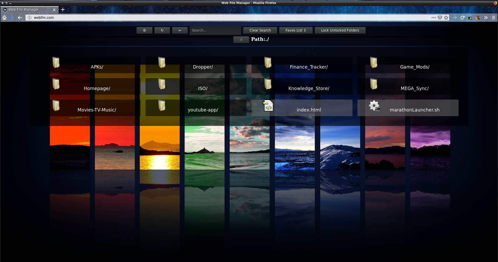
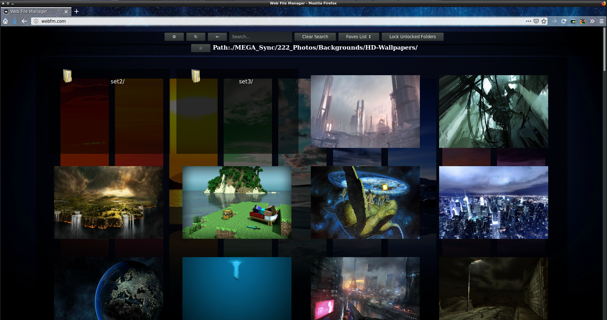
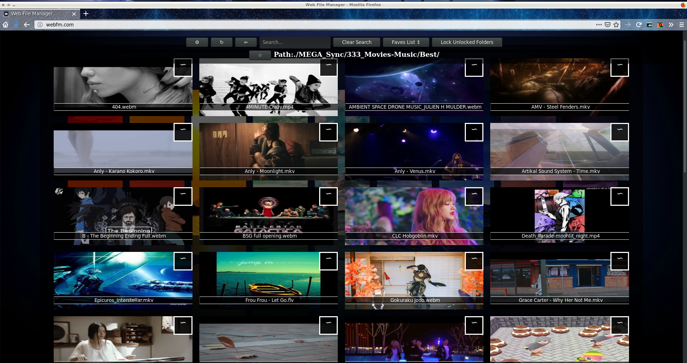
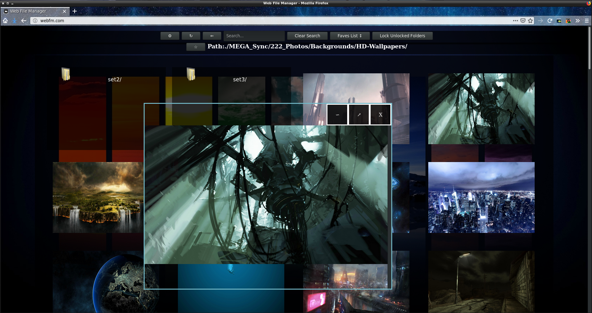
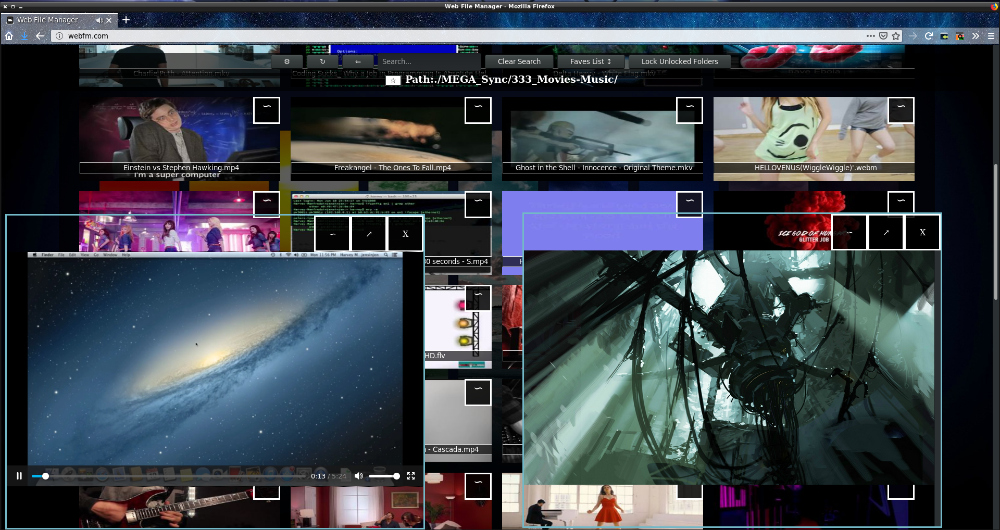
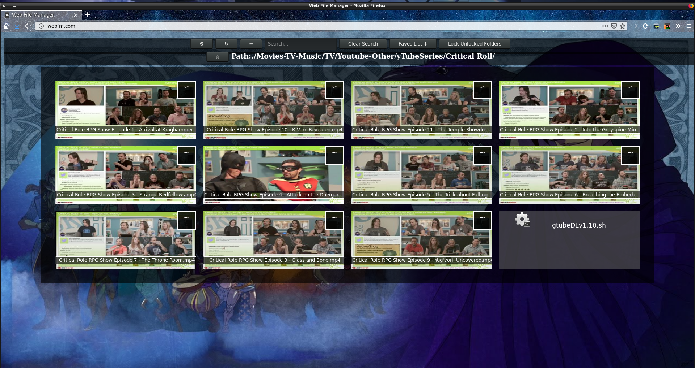

# WebFM
WebFM is a media and file viewer aspiring to become a full fledged file manager in the browser.

# Usage
1. Install python, sqlite3, and ffmpeg on the system this will be on.
3. Use ufw or gufw to open the port on your computer to the network.
4. Place files or start uploading some to the folders.
5. Place an image such as a jpg, png, or gif labeled "000.itsExtension" in a directory and the viewer will use it as the background image for that folder/directory.
9. Password protect folder based on core/webfm_config.json file settings.
10. Save paths to favorites list for quick access.

Notes:
n/a

# TO-DO
1. Allow for move and copy.
2. Implement themes functionality.

# Images

