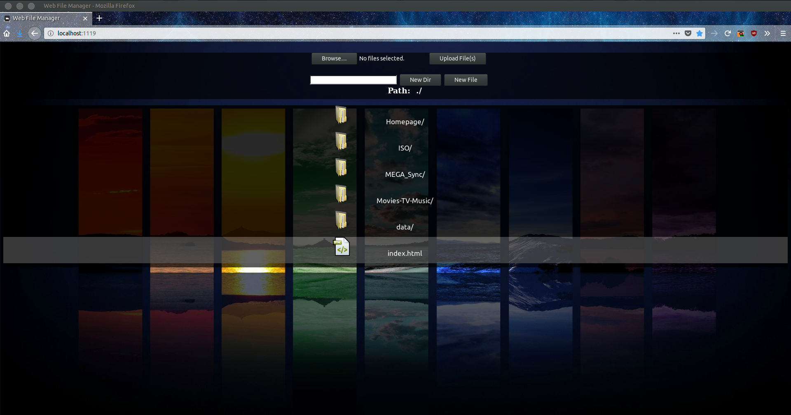
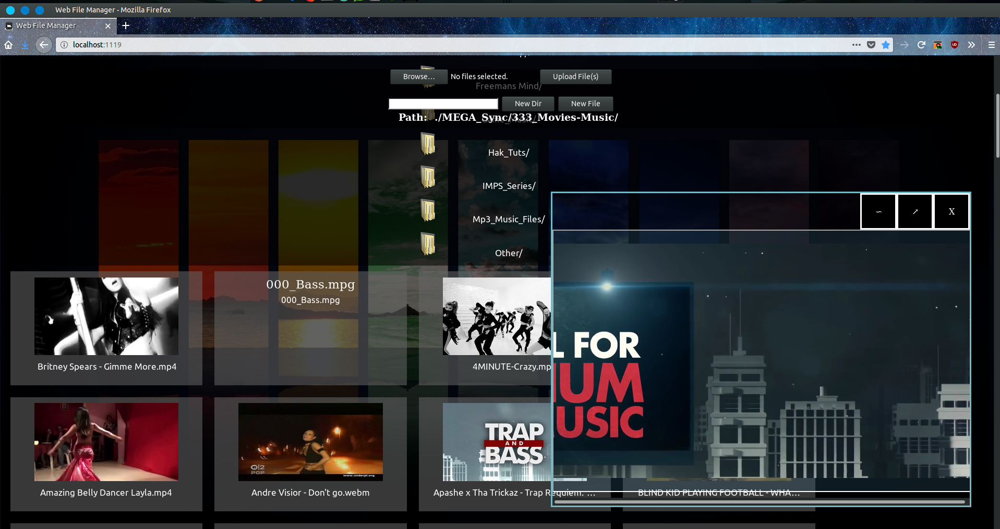
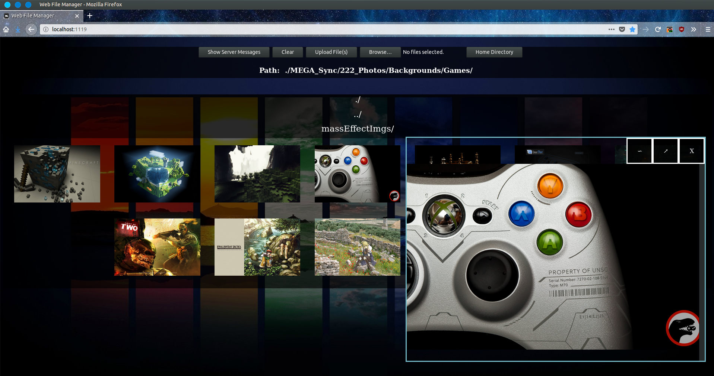
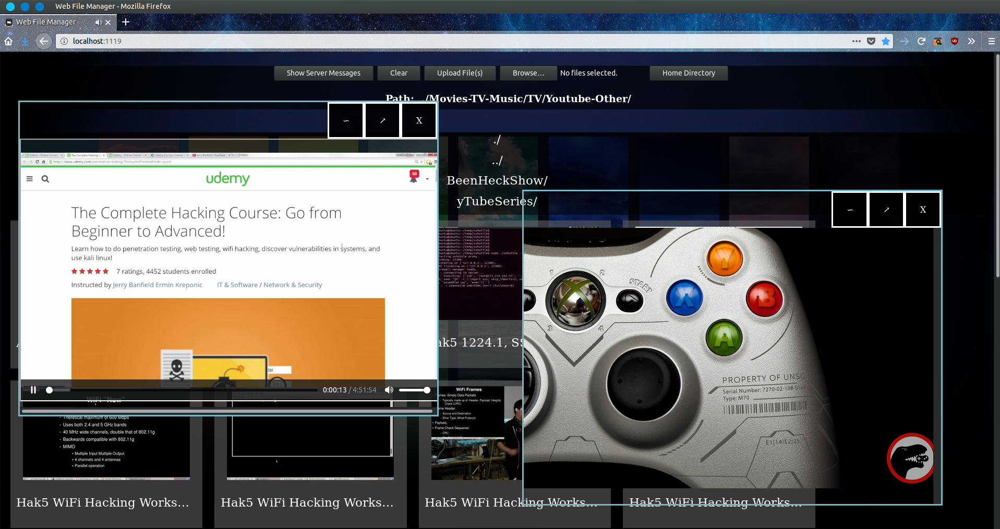
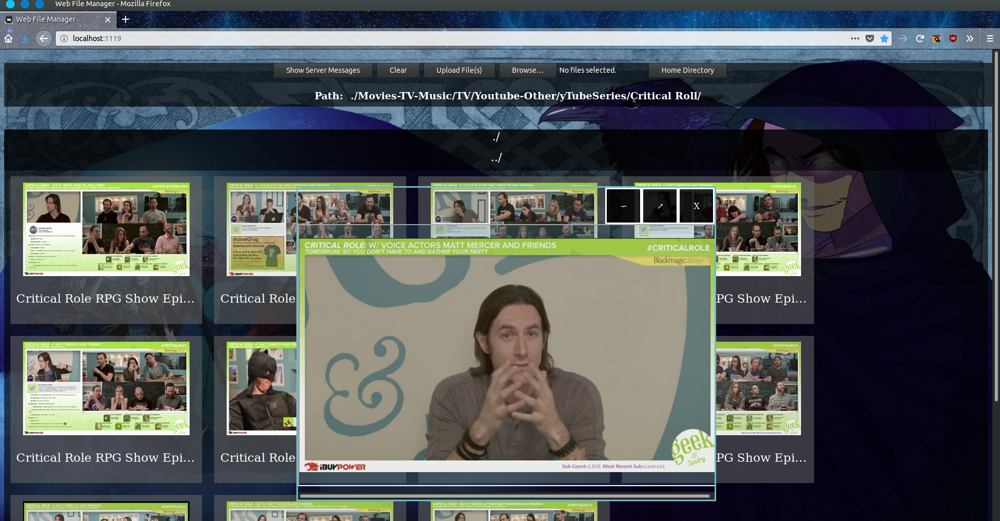

# WebFM
WebFM is a media and file viewer.

# Usage
1. Install php7 and ffmpeg on the system this will be on.
2. Use php -S 0.0.0.0:yourDesiredPort
3. Use ufw or gufw to open the port on your computer to the network.
4. Place files or start uploading some to the folders.

Notes:
1. Folders and files CAN NOT have & or '  in the names. Otherwise, you can't access that item with the viewer.
2. If you place an image such as a jpg, png, or gif labeled "000.itsExtension" in a directory then the viewer will use it as the background for that folder/directory.
3. The provided folders except "resources" are optional. You can add and remove them as you please.
4. The media and image pane can be moved by dragging from the transparentish bar that has the close button and other controls.

# TO-DO
1. Allow for move, copy, delete functionality.
2. Allow for creating folders through the web interface.
3. Fix the ' and & naming issue.
4. Resolve issue were uploading doesn't always prompt an interface update.
5. Impliment themes functionality.
6. Look to refactor code.

# Images

